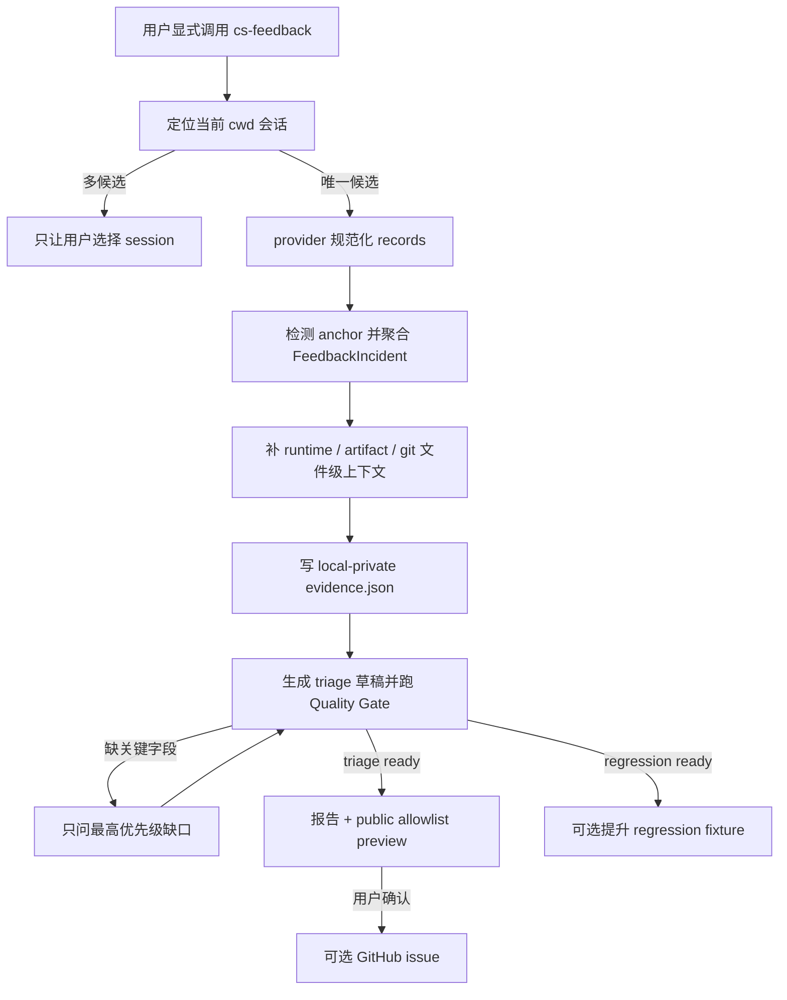

# CS Feedback Evidence Pipeline

## 0. 术语约定

| 术语 | 定义 | 防冲突结论 |
|---|---|---|
| 反馈事件包（Feedback Incident） | 围绕一次问题，把 agent 动作、工具结果、用户纠正和相关仓库事实按时间顺序聚合的证据单元 | 替代当前按单条 transcript record 排序的 `Event`，但保留旧 event 投影兼容期 |
| 客观观察（Observation） | 可指向 transcript record、工具结果或仓库产物的事实 | 不包含根因和修复建议 |
| 分析判断（Assessment） | agent 基于观察形成的 expected / actual、疑似归因和建议 | 必须标来源；仅 `source=inferred` 时必须有置信度，不能伪装成观察 |
| 反馈质量门（Feedback Quality Gate） | 机械检查反馈是否足够用于分诊或制作 regression fixture | 区分 `triage_ready` 与更严格的 `regression_ready` |
| 优化交接（Optimization Handoff） | 面向 CodeStable 维护者和 eval 闭环的结构化 `triage.json` | 不等同于 GitHub issue，也不直接修改被反馈 skill |

## 1. 决策与约束

### 1.1 需求摘要

用户目标：在使用 CS skill 过程中遇到问题后，通过显式调用 `cs-feedback`，尽量少补充信息就能留下对后续优化真正有用的证据。

核心行为：

- 默认只定位当前 cwd 对应的当前会话；无法唯一定位时让用户选，不静默扩大到最近三天全部历史。
- 从离散命中升级为因果事件包，保留角色、顺序、工具名、用户纠正和证据指针。
- 用当前仓库的 runtime 版本、相关 `.codestable` 产物状态和 git 文件级状态补足使用环境，但不复制业务代码。
- 自动生成客观 evidence、结构化 triage、public preview；只针对质量门缺失项追问用户。
- `triage_ready` 的反馈可直接进入维护分诊；只有 `regression_ready` 才允许提升为正式 regression fixture。

成功标准：

- 常见“agent 走错阶段 / 跳过 gate / 工具失败 / 用户纠正”场景能恢复 target skill、可能阶段、expected、actual、关键时间线、模型/宿主、runtime 版本和相关产物。
- 所有推断字段可追溯到观察或用户补充；未知字段明确为 unknown，不编造。
- public preview 不含绝对路径、remote、环境变量、secret、原始工具参数、大段业务代码或完整 transcript。
- 不完整反馈仍可保存，但质量门列出缺口；fixture promotion 对未就绪输入 fail closed。
- Codex JSONL 与 Claude JSON/JSONL 的相同语义得到同构事件包。

明确不做：

- 不做后台遥测、常驻监听、自动上传或默认扫描全部历史。
- 不因捕获反馈而自动修改目标 skill、创建 GitHub issue或启动付费模型评测。
- 不把 LLM 猜测写进客观 evidence；不把“模型偶发”直接归因成“skill 缺陷”。
- 不把完整仓库 diff、业务文件内容、原始 session 路径写入公开产物。
- 不保证每条反馈都能转为 fixture；不可复现反馈仍可用于聚类和人工分诊。

### 1.2 方案深度与复杂度档位

候选 A 是只扩充关键词和上下文窗口；它改动小，但仍无法表达因果关系，继续把核心价值押在文本命中率上。候选 B 是本方案的本地反馈证据管线；它保留显式触发和无网络边界，同时把数据结构做到可持续演进。候选 C 是 opt-in 遥测服务；它能提高数量，但引入服务端、身份、授权和合规体系，超出本轮目标。

选择候选 B。该能力是长期维护、直接处理私人 transcript、并承担后续评测输入质量的核心路径，不能用“多抓几行文本”的占位方案代替。

偏离内部工具默认档位：

- Robustness = L3：外部 transcript、JSON schema 和文件路径全部验证，失败路径可诊断。
- Structure = modules：当前 520 行采集器已混合来源解析、筛选、脱敏和输出，先按职责拆分。
- Testability = verified：隐私边界、事件聚合和 readiness 都需要负向不变量测试。
- Security = hardened：按 transcript 可能含 secret、私有路径和业务代码的对抗性输入设计。
- Compatibility = backward-compatible：schema v2 以 `incidents` 为权威，v1 投影至少保留至下一 minor release；删除只能进入 major/schema migration。

### 1.3 关键决策

1. **显式调用才采集。** CS skill 遇到自身规则、工具或流程异常时可提示用户调用 `cs-feedback`；不得后台执行或上传。
2. **当前会话优先落在 skill 编排层。** 默认调用只传 `--session current --cwd "$(pwd)"`；用户显式 `--since-days` 时走跨会话且不传 current。collector 的 `session=None + since_days=3` 保持 v1 兼容；若直接同时传 current/since-days，则 current 在应用 `time_cutoff` 前分支并输出 `since_days_ignored=true`。只有 cwd 精确匹配且候选唯一才自动选择，弱匹配或多候选都让用户选。
3. **事件包是 canonical 单元。** collector 先冻结输入：JSONL 记完整 record 的 EOF offset，单 JSON 一次读成不可变 byte snapshot；`trigger_cutoff` 只认 snapshot 内最后一条 user record，是 `triage_ready` 前置，缺失时任何 failure signal 都不能替代。anchor 后记录排除。call/result 优先按 provider id 配对；无 id 只配忽略 metadata 后紧邻且无竞争 call 的 call→result；`correlation_source=provider/adjacency/unpaired`。unpaired 记录按 source order 进 timeline，result 可凭 failure 成为 incident signal，但不满足 cutoff、不挂猜测 call；窗口只合并重叠或显式 correlation edge。
4. **观察与判断分层。** `evidence.json` 保存脱敏观察和本机上下文；`triage.json` 保存 expected / actual、疑似范围、建议和 readiness，并给每个判断挂 evidence ids / user-supplied 标记。
5. **双层隐私投影。** public preview 只从 allowlist 字段构建，绝不从人写报告反向抓文本；`evidence.json` 与 `triage.json` 默认 local-private。
6. **质量门驱动追问。** 优先补 target skill、expected、actual、影响、最小复现输入和 oracle；已能从用户纠正或仓库事实确定的内容不重复问。
7. **fixture 提升 fail closed 且不跨 skill 依赖。** shipped `feedback_to_fixture.py` 只把 canonical `triage.json` 转为同目录 local-private candidate；v1 `--evidence` 也只能产未就绪 candidate，旧 `--failure --experiment` 及其他 shipped `--experiment` 直写入口返回迁移错误。正式 fixture 仅由 repo-local `eval-cs-skill` promotion 工具消费 candidate；普通用户仓库无 eval 工具时保留 candidate，不降级、不写 `experiments/`。
8. **共享提示集中维护。** “遇到 CS 自身问题可调用 cs-feedback”写入 execution conventions 模板及 runtime copy，不向每个 skill 重复塞一段规则。

### 1.4 风险、依赖与假设

Top 3 风险：

1. **隐私泄露。** 缓解：local/private 与 public projection 分离、allowlist 构建、敏感输入负向测试、上传前人工确认。
2. **错误归因或无信号 fixture 污染优化。** 缓解：Observation/Assessment 分层，cause=`unclassified`，promotion profile/config gate；acceptance 仍记录 recall_judge `[soft]`、k=1 variance 与人工读输出的残余风险。
3. **跨 provider transcript 漂移。** 缓解：provider adapter 只负责规范化为统一 record；未知记录保留但不猜角色或工具语义。

非显然依赖：当前 session 定位仍依赖 transcript 中的 cwd/mtime metadata；`.codestable/runtime-manifest.json` 可能不存在或落后，必须把 unknown / mismatch 当环境事实而非采集失败。

关键假设：本轮默认用户愿意在明确调用 `cs-feedback` 后让工具读取当前会话的本机历史，但任何公开或上传仍需逐次确认。

基线与必跑验证：

- `PYTHONDONTWRITEBYTECODE=1 python3 -m pytest -q tests/test_cs_feedback*.py tests/test_cs_skill_bootstrap.py tests/test_skill_entry_simplification.py`：当前 45 passed。
- `PYTHONDONTWRITEBYTECODE=1 python3 -m pytest -q tests`：当前 215 passed。
- `python3 tools/check-plugin-package.py --root . --json`：当前被 ignored 的根 `cs-onboard/` legacy 目录触发既有失败；本 feature 不删除该用户资产，验收时要求 findings 不新增。
- `python3 plugins/codestable/skills/cs-onboard/tools/codestable-runtime-sync.py --root . --source-skill-dir plugins/codestable/skills/cs-onboard --check --json`：当前 status=ok。
- `git diff --check`：当前通过。

交付物：cs-feedback 协议与模板、shared-conventions 模板/runtime 布局、schema v2 本地反馈包、事件聚合与仓库上下文采集、质量门、eval-compatible fixture 安全提升、测试、decision fixtures、README/WORKFLOW/catalog 投影和完整 gate 证据。

清洁度：不新增调试输出、临时 TODO/FIXME、原始 transcript fixture、真实 secret、注释掉代码或未使用 compatibility 分支。

## 2. 名词与编排

### 2.1 名词层

**现状**：`collect_feedback_context.py` 将 provider 记录 flatten 成字符串，产出按分数排序的 `Event`；`public_summary_for()` 只输出 provider、粗粒度 failure type、tool、skill 和 excerpt。公开 allowlist 虽列出 expected / actual / proposed_fix，实际采集器没有生成。`feedback_to_fixture.py` 直接从 event 摘要生成带 TODO 的 skeleton。

**变化**：

- 新增 `NormalizedRecord`：`id / provider / timestamp / role / record_type / tool_name / correlation_id / correlation_source / text / source_index`。
- 新增 `FeedbackIncident`：`id / target_skill / stage_hint / incident_kind / observations[] / timeline[] / environment_context / repo_context / user_correction / capture_cutoff`。
- 新增 `FeedbackTriage`：`target / assessment / reproduction / quality / privacy_review`；每个值对象内联 `source / evidence_refs`；它是 shipped candidate converter 的唯一权威输入。
- 新增 `FeedbackQuality`：`triage_ready / regression_ready / missing_fields / reasons`。
- `match_types` 仅表示观测信号。canonical `incident_kind` 取值为 `wrong-route / skipped-gate / missing-artifact / tool-failure / goal-driver / unnecessary-detour / install-version / privacy-reporting / unclear-rule / unknown`；v1 `failure_type` 只作兼容映射。
- v1 10→6 映射固定为：`wrong-route/skipped-gate/missing-artifact/unnecessary-detour→agent-detour`、`tool-failure→tool-failure`、`goal-driver→goal-driver`、`install-version→install-distribution`、`unclear-rule→unclear-rule`、`privacy-reporting/unknown→unknown`。public `events[].failure_type` 值域不扩张；v2 `incident_kind` 只进 `incidents`。
- `evidence.json` schema v2 以 `incidents` 为权威；旧 `matched_events` 保持 v1 字段。public `events` 冻结现有 8 字段；新 `incidents` 只允许 `incident_kind/target_skill/stage_hint/expected_behavior/actual_behavior/impact/proposed_fix`，GitHub body 只从该投影渲染，所有字符串再次 public redaction。

`evidence.json` 只含 observation：

```json
{"schema_version":2,"privacy":"local-private","incidents":[{"id":"incident-01","target_skill":"cs-feat","observations":[{"id":"obs-04","role":"assistant","record_type":"message"}],"capture_cutoff":"record-18"}]}
```

`triage.json` 是 Assessment 与 promotion 的最小消费契约：

```json
{
  "schema_version": 2,
  "privacy": "local-private",
  "incident_id": "incident-01",
  "target": {"skill": "cs-feat", "stage_hint": "design-review", "suspected_area": "SKILL.md"},
  "incident_kind": "skipped-gate",
  "assessment": {
    "expected_behavior": {"value": "第二轮仍派独立 reviewer", "source": "user", "evidence_refs": ["obs-05"]},
    "actual_behavior": {"value": "主 agent 本地自审后继续", "source": "transcript", "evidence_refs": ["obs-04"]},
    "impact": {"value": "独立审查 gate 被跳过", "source": "inferred", "confidence": "high", "evidence_refs": ["obs-04", "obs-05"]},
    "cause_status": "unclassified"
  },
  "reproduction": {"eval_profile": "routing-decision", "task_kind": "routing", "input": null, "oracle": null, "evidence_refs": []},
  "quality": {"triage_ready": true, "regression_ready": false, "missing_fields": ["reproduction.input", "reproduction.oracle"]},
  "privacy_review": {"status": "pending"}
}
```

每个 `triage.json` 只指向一个包含 `trigger_cutoff` 的 primary incident；无法唯一关联时先让用户选择，其他 incidents 留在 evidence 中另行分诊，converter 拒绝空或歧义 `incident_id`。

`triage_ready` 要求 session/incident 已唯一、target skill、expected、actual 和 observation ref；`regression_ready` 还要求下表 profile、可重放 input 与 oracle。candidate converter 按白名单标记缺口；repo promotion 工具拒绝错配，`unknown` 一律未就绪。

| Profile | Allowed `incident_kind` | Candidate → eval fixture | Repo promotion checks |
|---|---|---|---|
| `routing-decision` | wrong-route, skipped-gate, missing-artifact, goal-driver, unnecessary-detour | `input.intent/state/utterance → task.*`; `oracle.expect → expect`; `answerType=routing-decision`; `task.kind=routing` | 至少一个非空 state/intent/utterance；校验 `expect.result_type`、config 含 `routing_decision`，再跑同 skill 内 validator/buildPrompt |
| `findings-recall` | tool-failure, install-version, privacy-reporting, unclear-rule | `input.spec/diff/context/audience → task.*`; `oracle.coverage_points → answer`; `answerType=findings-recall`; `task.kind=review/fix/audit/design/docs` | review/audit 要 diff；fix 要 spec+diff；design 要 spec；docs 要 spec+diff；promotion 硬查 recall_judge、非空且非 mock judge_model，design/docs 非 mock harness，不复用 warning-only `judge_issues()` |

`findings-recall.task_kind` 由 target 派生：`cs-code-review→review`、`cs-issue→fix`、`cs-audit→audit`、`cs-feat/cs-refactor/cs-epic/cs-req/cs-domain→design`、`cs-docs/cs-docs-neat→docs`；其他 target 仅保留 candidate，并在 `quality.reasons` 写 `unsupported_target`。

默认 candidate 为同目录 `regression-candidate.json`，`_status=candidate`、`privacy=local-private`。

shipped CLI 固定为 `feedback_to_fixture.py --triage <path>` 或兼容 `--evidence <v1-public-context>`，只写同目录 candidate。repo-local `eval-cs-skill/scripts/promote_feedback_fixture.py --candidate <path> --experiment <dir>` 读取目标 `config.json`，在自身单元内完成表中校验；缺工具/config、空白或 `TODO/TBD/unknown` 都非零且不落盘，现有 validator 只作部分结构 gate。

promotion 只从 reproduction input/oracle 构建 fixture，不复制 assessment/excerpt/evidence 正文；要求 `privacy_review=approved`，再对全部字符串做 self-contained commit-safe 扫描。若 secret、绝对路径、remote/env 或 private marker 会被改写，则列出字段并拒绝，要求换成合成复现后重新批准，禁止静默写入失真的 fixture。

feedback 目录布局固定为 `{slug}-report.md / evidence.json / triage.json / public-issue-context.json? / github-issue.md? / regression-candidate.json?`，后三个问号项按 preview、上报和 fixture 交接需要生成；SKILL、shared-conventions 模板与 runtime copy 同步这一布局。

##### Interface 设计检查

- Module：反馈采集管线；由单文件改为 CLI orchestration + transcript normalization + privacy/projection + quality 模块。
- Interface：collector CLI 的直接调用默认保持兼容；skill 编排显式选择 current。schema v2 明确 privacy、ordering、unknown、readiness 与 compatibility projection。
- Seam：provider normalization 是真实变化点；Codex / Claude adapter 进入同一 record 接口。metadata-only reader 只从 path/top-level/session-meta 取 session/cwd/mtime，禁止 import/call `read_records`；cwd 只在正文时保持 unknown 并让用户选，用顶层 meta 正向、body-only 与输出子串负向测试锁定。
- Depth / locality：provider 格式、脱敏策略和 readiness 规则分别封装，避免每个 caller 重复理解 transcript schema。
- Dependency strategy：in-process，本地文件输入；不新增远程 adapter 或 LLM dependency。
- Adapter：Codex / Claude 两个真实 source adapter；测试使用合成 transcript，不 mock 核心聚合逻辑。
- Test surface：shipped capture/candidate CLI 与 repo promotion CLI 分别覆盖歧义、隐私、provider 漂移、config 和 fail-closed gate。

### 2.2 编排层



**现状**：默认扫描近三天文件，单条 record 独立匹配、取固定前后窗口并按 score 降序；agent 再从非结构化上下文手工写报告和 issue。

**变化**：skill 默认显式请求 current-session；collector 直接调用仍保留 v1 默认。先聚合事件包再排序。仓库 enrich 只读取模型/宿主 metadata、runtime manifest、相关 CodeStable artifact frontmatter/status 和 git 文件名状态。skill agent 基于 evidence 生成 triage，quality gate 决定追问、公开预览和 fixture candidate。

流程级约束：

- session ambiguity 阶段只走 metadata-only adapter；不得调用 `read_records`，JSON 容器即使需要解析也不得 normalize、flatten、匹配、持久化、保留或返回 message 正文。用户选定后再采集。
- transcript 顺序、role 和 tool pairing 必须保留；有 id、无 id 紧邻、无 id 歧义三种情况分别 exact/adjacency/unpaired，跨 user-turn incident 不因相同关键词合并。
- 采集、报告、公开、上报、fixture promotion 五个阶段分别可重试且幂等；不得覆盖用户手工补充字段。
- 推断值必须携带 source/confidence/evidence refs；无依据时保持 unknown。
- public projection 永远从结构化 allowlist 生成；上传器按文件名硬拒 `evidence.json/triage.json/regression-candidate.json`，并按 `privacy=local-private` 二次拒绝。
- quality score 只表达证据完备性，不代表问题严重度或 skill 一定有缺陷。

### 2.3 挂载点清单

1. `plugins/codestable/skills/cs-feedback/SKILL.md` 与 report-template：更新 incident/triage/quality、v1/v2 枚举分区和完整反馈目录布局。
2. `collect_feedback_context.py` 公共 CLI 与 schema v2 JSON：提供 current-session 事件包、current/since-days 优先级和 v1 failure 映射。
3. `feedback_to_fixture.py` 与 repo-local `eval-cs-skill/scripts/promote_feedback_fixture.py`：只用 candidate artifact 交接，后者拥有 config/validator/buildPrompt/scorer 与正式落盘。
4. `cs-onboard/references/{execution,shared}-conventions.md` 模板及项目 runtime copy：增加显式反馈提示并同步 feedback 产物布局。
5. tests、feedback decision fixtures、README / WORKFLOW / SKILL_CATALOG / system overview：锁定行为与对外投影。

### 2.4 推进策略

1. 行为等价拆分采集器与测试职责，保持现有 CLI/schema v1 测试全绿。
2. 引入 metadata-only session 选择、current 绕过 `time_cutoff`、`trigger_cutoff`、normalized record、incident 聚合和 repo context，落 schema v2 evidence 与兼容投影。
3. 引入 triage schema、字段来源和质量门，按缺口驱动 ask-user 与 public projection。
4. 把 shipped converter 收紧为 candidate-only；在 repo-local eval skill 增 promotion 工具，读取 config、做 commit-safe/profile gate，迁移旧 skeleton 测试。
5. 接入共享反馈提示，同步 SKILL/report-template 的 current 参数与两套枚举，并更新用户文档、runtime 模板/副本。
6. 补跨 provider、隐私对抗、quality/promotion、skill decision fixtures，完成评测与全量 gate。

### 2.5 结构健康度与微重构

##### 评估

- 文件级 — `collect_feedback_context.py`：520 行，混合 transcript 解析、session 发现、匹配、脱敏、公共投影和 CLI 输出，新增 incident 会成为第六项职责。
- 文件级 — `feedback_to_fixture.py`：81 行，收紧为 candidate-only；正式 promotion 新逻辑放 repo-local eval skill，避免 shipped skill 依赖维护者工具。
- 文件级 — `tests/test_cs_feedback.py`：436 行，已混合采集、session 解析、隐私和 GitHub reporter；新增 quality/promotion 测试会跨过 500 行并进一步混杂。
- 目录级 — `cs-feedback/scripts/` 当前 3 个同层文件；拆出 2-3 个职责模块后仍低于摊平阈值，命名可按 `feedback_*` 聚类。
- 目录级 — `tests/` 已是仓库约定的扁平测试根；按反馈子职责拆测试文件，不另造嵌套结构。
- compound 未发现目录组织或命名约定。

##### 结论：微重构（拆文件）

##### 方案

- 搬什么：把 provider/session 规范化、隐私投影、数据类型从 collector CLI 中搬出；把现有 reporter 测试从采集测试中搬出。
- 搬到哪：`scripts/feedback_transcripts.py`、`scripts/feedback_privacy.py`、`scripts/feedback_models.py`；测试按 capture / reporting / fixture promotion 分文件。
- 行为不变怎么验证：拆分提交点前后既有 9 个 `test_cs_feedback.py` 用例全绿；CLI 参数、schema v1 字段和值不变；`git diff` 只含移动、import 与测试重排。
- 步骤序列：先移动纯函数与 dataclass，再移动 source discovery，最后收薄 CLI；每次移动后跑 targeted tests。

超出范围的观察：`report_feedback_issue.py` 的 GitHub/proxy 逻辑与证据采集独立，本 feature 不重构其网络策略。

## 3. 验收契约

### 3.1 关键场景

1. 用户在当前 cwd 唯一会话调用 `cs-feedback` -> skill 不传 since-days；collector current 分支只绕过 `time_cutoff` 并自动选择，不扫描其他 repo 会话。
2. 当前 cwd 有多个候选 -> metadata-only 路径不 flatten/match/persist 正文，候选输出不含 message/tool 子串并只问用户选哪一个。
3. agent 动作、tool failure、user correction 连续出现 -> 有 id 精确配对、无 id 紧邻配对；歧义 call/result 各自按 source order 进 timeline 且不猜配对，仍生成有序 incident。
4. 同一 session 的两个 CS 问题落在不重叠 user-turn 窗口 -> 生成两个 incident，不因 skill 名相同误合并。
5. 用户纠正明确说明“应该怎样” -> expected source=user；actual 指向此前 assistant/tool observation。
6. 只有“有问题”但缺 expected -> 保存反馈并将 `expected_behavior` 列入 quality gap，只追问这一项。
7. runtime manifest 和相关 artifact 存在 -> triage 包含版本、repo-relative artifact/status；缺失则记录 unknown/mismatch，不失败。
8. transcript 含 secret、绝对路径、remote URL、环境变量、原始工具 JSON 和代码块 -> local evidence 先脱敏，public preview 进一步移除；reporter 拒绝 evidence、triage 和 candidate 三类 local-private 文件。
9. assessment 无 evidence ref -> quality gate 不允许 `triage_ready=true`。
10. triage ready 但缺 reproduction/oracle -> 可生成维护报告和 issue preview，不能 promotion 为正式 fixture。
11. regression ready -> shipped converter 只产 candidate；repo promotion 缺 config、空 input/占位、敏感字符串或不兼容 scorer/harness/judge 时不落盘，有效输入才写正式 fixture；旧直写非零。
12. 旧 schema v1 public context -> reporter 仍可读取，converter 只生成未就绪 candidate；events 的 v1 `failure_type` 与 incidents 的 v2 `incident_kind` 分区且精确 8 字段不变。
13. CS skill 遇到规则/工具问题 -> 共享约定只提示显式调用 `cs-feedback`，不自动采集或上传。
14. 用户未确认 public preview -> reporter 不调用 `gh issue create`；确认后仍只上传 allowlist body。
15. 冻结边界内找不到 user anchor -> `trigger_cutoff=unknown` 且 triage 未就绪；找到 anchor 时其后的 assistant/tool 记录绝不进入 evidence。
16. Codex JSONL 与 Claude JSON/JSONL 表达同一 tool failure + user correction -> 生成字段、顺序、配对语义同构的 incident。

反向核对：代码和 skill 文本不应出现后台 telemetry、自动上传、默认全历史扫描、把 assessment 写入 observations、未就绪 skeleton 直接进入正式 fixtures 的路径。

### 3.2 Acceptance Coverage Matrix

| Scenario | Covered By Step | Evidence Type | Command / Action | Core? |
|---|---|---|---|---|
| 1-2 current session 与 ambiguity | S2 | unit + CLI test | targeted pytest | yes |
| 3-4 tool 配对、incident 聚合与分离 | S2 | positive/ambiguous unit | targeted pytest | yes |
| 5-6,9 observation / assessment 与缺口 | S3 | schema + decision fixture | pytest / eval fixture | yes |
| 7 runtime/artifact enrich | S2 | isolated repo test | targeted pytest | yes |
| 8 private/public 脱敏与上传拒绝 | S3-S5 | adversarial negative test | targeted pytest | yes |
| 10-11 candidate/repo promotion | S4 | config/privacy/validator positive+negative | targeted/ADR lint pytest | yes |
| 12 v1 compatibility | S1-S4 | regression test | targeted pytest | yes |
| 13 显式提示、无自动采集 | S5 | static contract test | targeted pytest | yes |
| 14 上传确认 | S5 | reporter negative test | targeted pytest | yes |
| 15 trigger cutoff 锚点与后续排除 | S2 | positive/negative unit | targeted pytest | yes |
| 16 跨 provider 同构 | S2 | paired synthetic transcripts | targeted pytest | yes |
| 1-16 完整 gate | S6 | command + independent review | full pytest/runtime/diff | yes |

### 3.3 DoD Contract

| ID | 要求 | 证据 | 阻塞级别 |
|---|---|---|---|
| DOD-DESIGN-001 | design/checklist 经独立 Task agent review | design-review report | blocking |
| DOD-IMPL-001 | 六个 steps 完成且 schema/compat 证据落盘 | checklist + implementation report | blocking |
| DOD-REVIEW-001 | 代码 review 无 unresolved blocking/important | review report | blocking |
| DOD-QA-001 | 隐私、聚合、quality、promotion 和全量测试通过 | QA report | blocking |
| DOD-ACCEPT-001 | 16 个场景、文档/runtime 投影和最终清洁度核对 | acceptance report | blocking |

Required Artifacts: design-review、implementation report、code review、QA、acceptance、feedback routing fixtures、测试输出。

## 4. 与项目级架构文档的关系

本 feature 落实 ADR-003 的“生产失败 -> regression fixture”，把旧直写脚本改成 candidate artifact 边界，并由 repo-local eval skill 拥有正式 promotion；需更新 ADR applies-to/Consequences 与 lint 套件，不新增 ADR。共享提示同步 execution conventions 模板/runtime；README、WORKFLOW、catalog 和 system overview 只投影用户入口。
